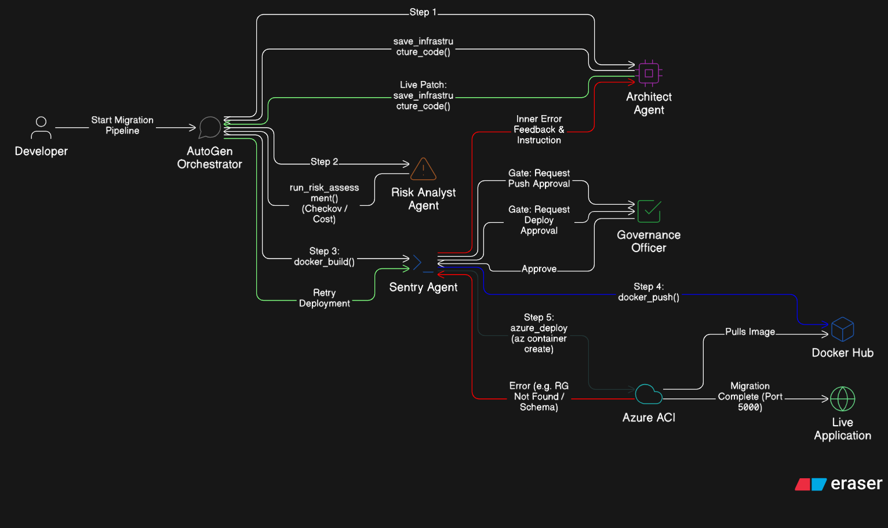

# 🚀 MigratAI: Autonomous, Self-Healing Cloud Pipeline


**MigratAI** is a Cognitive Multi-Agent System that autonomously generates, secures, and deploys cloud infrastructure. It replaces static, rigid CI/CD pipelines with intelligent AI agents that actively negotiate, reason, and **self-heal** deployment errors in real-time.

---

## ⚠️ The Problem: The DevOps Bottleneck
Migrating applications to the cloud is a highly manual process prone to infrastructure misconfigurations. Traditional CI/CD tools are static and "dumb." When an Azure deployment fails due to a simple schema error, the pipeline crashes, requiring hours of manual human debugging, log-reading, and code rewriting. 

## 💡 The Solution: Agentic Resilience
MigratAI introduces an automated workforce powered by **Microsoft AutoGen**. Instead of failing fast, our agents trap cloud errors, analyze the logs, rewrite the infrastructure code, and seamlessly retry the deployment—achieving **zero-touch recovery** at machine speed.

## 📂 The Sample Workload (`/code`)
This repository comes pre-packaged with a `code/` directory containing a sample Python Flask application. This serves as the **target workload** for the demo. 

When you run the orchestrator, the **Architect Agent** reads directly from this local `code/` folder to understand the application's dependencies and automatically generate the necessary `Dockerfile` and infrastructure configurations. *(Note: You can swap out the contents of this folder with your own app to test the AI's adaptability!)*
---

## 🧠 The Agentic Workforce (Architecture)



Our system operates in a deterministic 5-step pipeline utilizing specialized agents:

1. 🏗️ **The Architect Agent:** Analyzes local application code and autonomously generates the `Dockerfile` and Azure Infrastructure-as-Code.
2. 🛡️ **The Risk Analyst:** Enforces "Shift-Left" security by running a 0-day Checkov vulnerability scan and calculating real-time Azure vCPU cost estimates to generate an Enterprise Governance Report.
3. ⚔️ **The Sentry Agent (DevSecOps):** The execution arm. Builds the Docker image locally, pushes to Docker Hub, and triggers the `az container create` deployment commands.
4. 🧑‍⚖️ **The Governance Officer (Human-in-the-Loop):** Enterprise AI must be safe. Our system completely pauses before any cloud mutation or public push, requiring the human operator to explicitly type `approve`.

## ✨ The "Magic Moment": The Self-Healing Loop
If Azure rejects the deployment (e.g., an invalid `memory` limit or bad schema), the **Sentry Agent** intercepts the failure. It opens a cognitive feedback loop to the **Architect**, feeding it the raw cloud error. The Architect dynamically live-patches the code, and the Sentry automatically retries the deployment until successful. 

---

## 🛠️ Tech Stack
* **Orchestration:** Microsoft AutoGen (`GroupChat`)
* **LLM:** Azure OpenAI (GPT-4)
* **Cloud Target:** Azure Container Instances (ACI)
* **Containerization:** Docker Engine & Docker Hub
* **Security Tooling:** Checkov 

---

## 🚀 How to Run (Getting Started)

To run this autonomous pipeline locally, your environment must meet a few specific constraints.

### ⚠️ Prerequisites & Constraints
1. **Python 3.9+** installed on your machine.
2. **Docker Engine** must be installed and actively running in the background (e.g., Docker Desktop open).
3. **Azure CLI (`az`)** installed locally.
4. **Active Cloud Accounts:** You need an Azure Subscription (with permissions to create Resource Groups and Container Instances) and a Docker Hub account.

### 1. Clone the Repository
```bash
git clone [https://github.com/yuviiitm26/MigratAI.git](https://github.com/yuviiitm26/MigratAI.git)
cd MigratAI
